# Procesverslag
Markdown is een simpele manier om HTML te schrijven.  
Markdown cheat cheet: [Hulp bij het schrijven van Markdown](https://github.com/adam-p/markdown-here/wiki/Markdown-Cheatsheet).

Nb. De standaardstructuur en de spartaanse opmaak van de README.md zijn helemaal prima. Het gaat om de inhoud van je procesverslag. Besteedt de tijd voor pracht en praal aan je website.

Nb. Door *open* toe te voegen aan een *details* element kun je deze standaard open zetten. Fijn om dat steeds voor de relevante stuk(ken) te doen.

## Jij

uitwerken voor kick-off werkgroep

### Auteur:
Nikita Hoogenboom

#### Je startniveau:
Blauw

#### Je focus:
Surface plane
 

## Je website

uitwerken voor kick-off werkgroep

### Je opdracht:
Link naar de website: https://www.debijenkorf.nl/wonen

#### Screenshot(s) van de eerste pagina (small screen): 
Pagina: home
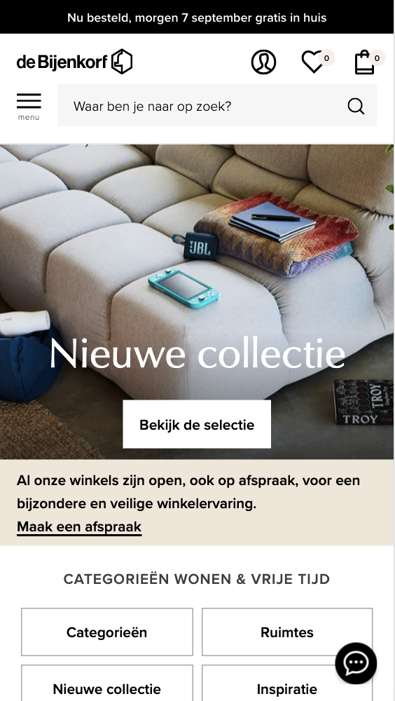
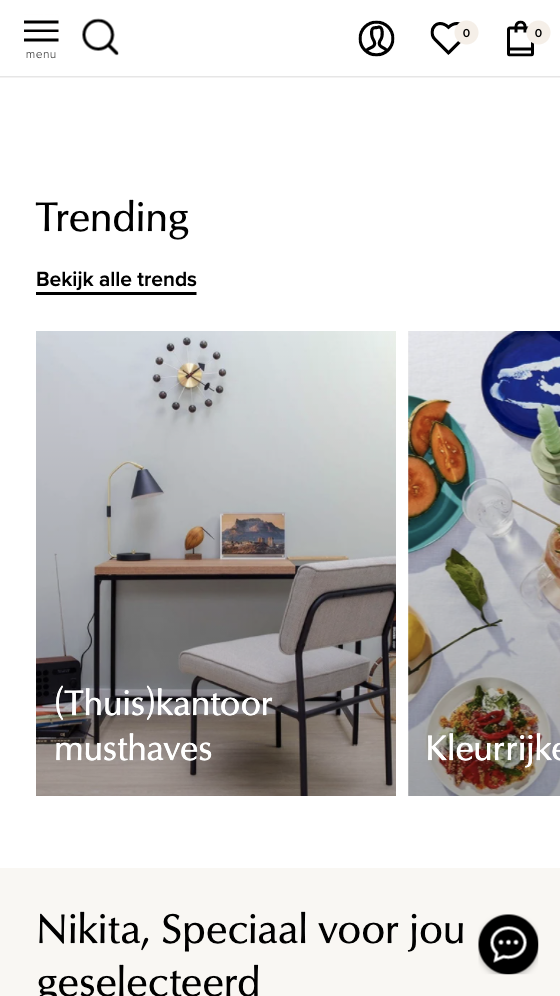
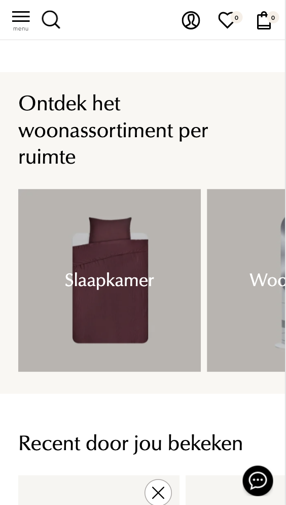
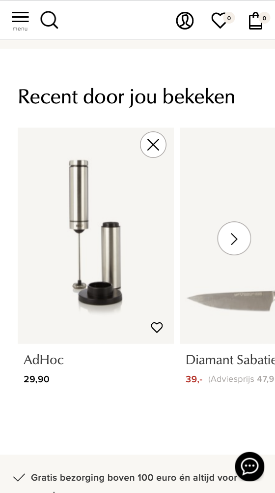
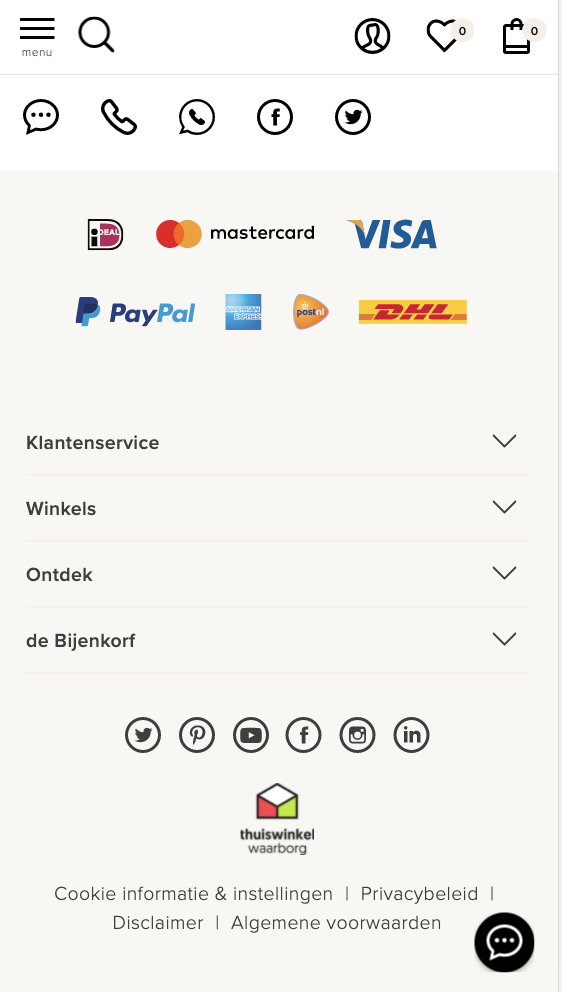

#### Screenshot(s) van de tweede pagina (small screen):
Pagina: woonruimtes 
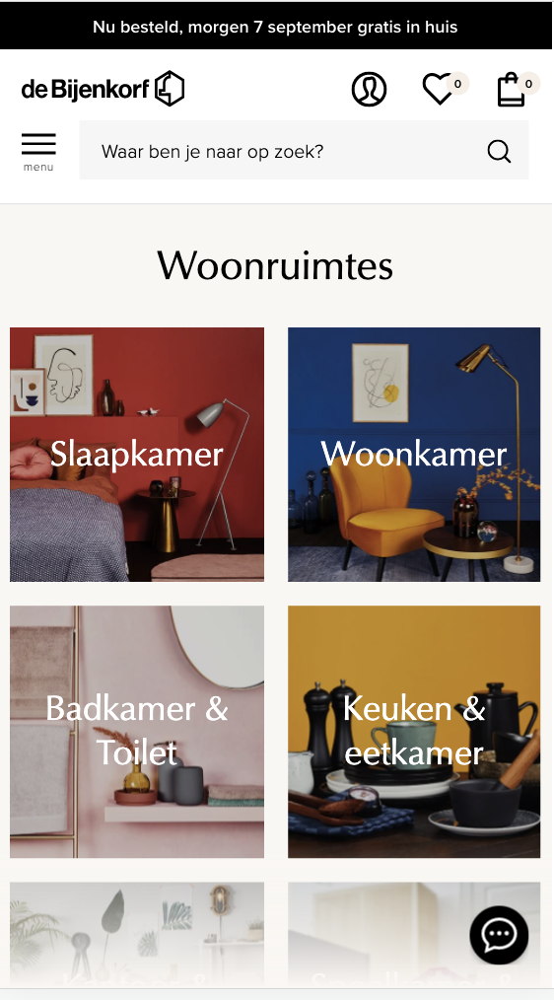
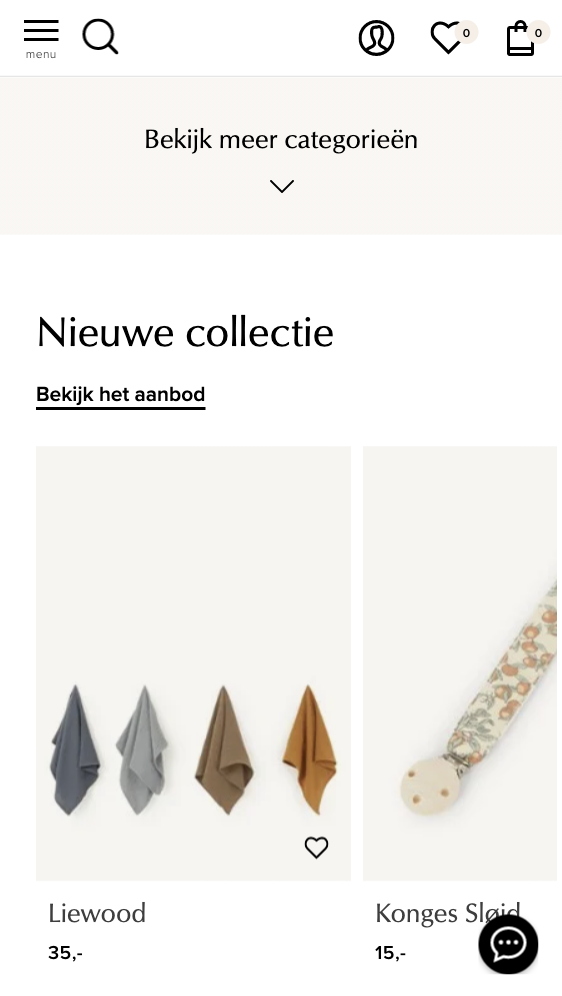
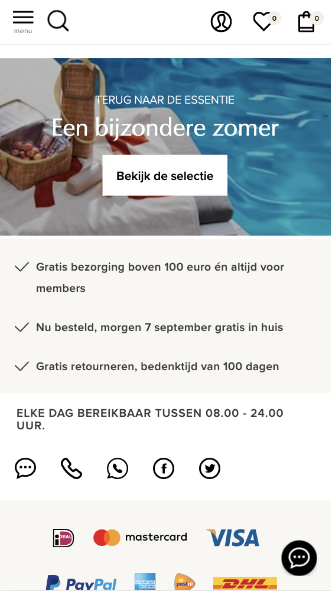
 

## Breakdownschets (week 1)

uitwerken na afloop 2e werkgroep

### de hele pagina: 
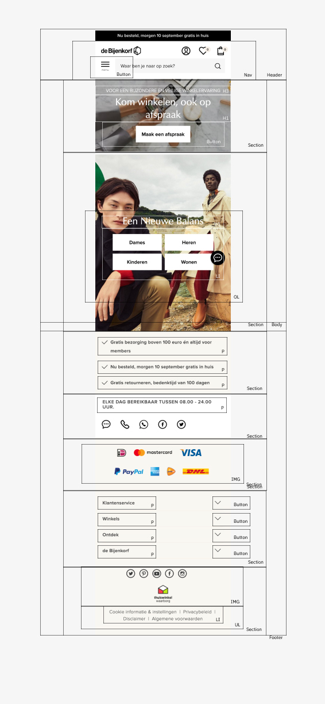
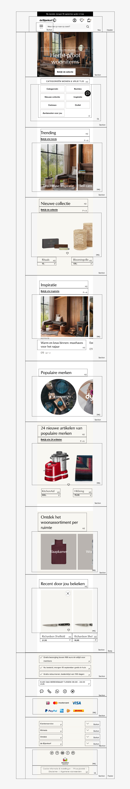

### dynamisch deel (bijv menu): 
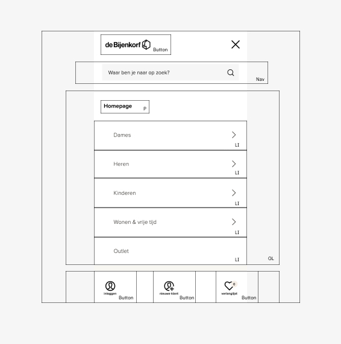

## Voortgang 1 (week 2)

uitwerken voor 1e voortgang

### Stand van zaken
Ik heb alle basis html van de homepagina geschreven en ben begonnen aan mijn css. Ik liep er vooral tegenaan dat het responsive maken van mijn website complexer was dan ik dacht.

### Agenda voor meeting
samen met je groepje opstellen

| student 1      | student 2          | student 3    | student 4        |
| ---            | ---                | ---          | ---              |
| dit bespreken  | en dit             | en ik dit    | en dan ik dat    |
| en dat ook nog | dit als er tijd is | nog een punt | dit wil ik zeker |
| ...            | ...                | ...          | ...              |

### Verslag van meeting
hier na afloop snel de uitkomsten van de meeting vastleggen

- punt 1
- punt 2
- nog een punt
- ...

## Voortgang 2 (week 3)

uitwerken voor 2e voortgang

### Stand van zaken
Mijn eerste pagina is (zo goed als) af en ik ben nu begonnen met de surface plane. Ook begin ik nu met mijn 2e pagina.

### Verslag van meeting
- Ik weet nu hoe ik mijn hamburgermenu kan laten werken
- Ik moet ervoor zorgen dat mijn pagina tab-baar is

## Toegankelijkheidstest (week 4)

uitwerken na test in 8e voortgang

### Bevindingen
Lijst met je bevindingen die in de test naar voren kwamen:

#### Titel eerste bevinding
<strong>Central field loss</strong>
Header/button contrast is te laag
Tekst contrast te laag

#### Titel tweede bevinding. 
<strong>Low contrast</strong>
Border rondom zoekbalk
Lijntjes onder de links (a)

## Voortgang 3 (week 4)

uitwerken voor 3e voortgang

### Stand van zaken
Mijn paginas zijn nu beiden compleet qua html/css en ik wil nu alleen nog wat extra microinteracties en button states toevoegen

### Agenda voor meeting
samen met je groepje opstellen

| student 1      | student 2          | student 3    | student 4        |
| ---            | ---                | ---          | ---              |
| dit bespreken  | en dit             | en ik dit    | en dan ik dat    |
| en dat ook nog | dit als er tijd is | nog een punt | dit wil ik zeker |
| ...            | ...                | ...          | ...              |

### Verslag van meeting
hier na afloop snel de uitkomsten van de meeting vastleggen

Html
- Pseudoclasses
- Comments toevoegen
- Href vullen met .wonen

Css
- Div van de a weghalen

## Eindgesprek (week 5)

uitwerken voor eindgesprek

### Stand van zaken
Ik heb mijn code wat netter gemaakt (minder classes, pseudoclasses) en dat was meer werk dan ik had gedacht. Ook heb ik mijn code door de validator gehaald.

### Screenshot(s)

## Bronnenlijst

1. Stack overflow 
https://stackoverflow.com/questions/27853884/media-queries-and-image-swapping/27853917
https://stackoverflow.com/questions/35180361/css-before-and-after-not-working
https://stackoverflow.com/questions/50301770/aligning-svgs-using-flex

2. codeSTACKr
https://www.youtube.com/watch?v=dIyVTjJAkLw

3. Css-tricks
https://css-tricks.com/snippets/css/complete-guide-grid/
https://css-tricks.com/snippets/css/a-guide-to-flexbox/

4. W3schools
https://www.w3schools.com/cssref/pr_border.asp
https://www.w3schools.com/cssref/pr_pos_z-index.asp

5. Box shadow CSS Generator
https://html-css-js.com/css/generator/box-shadow/

